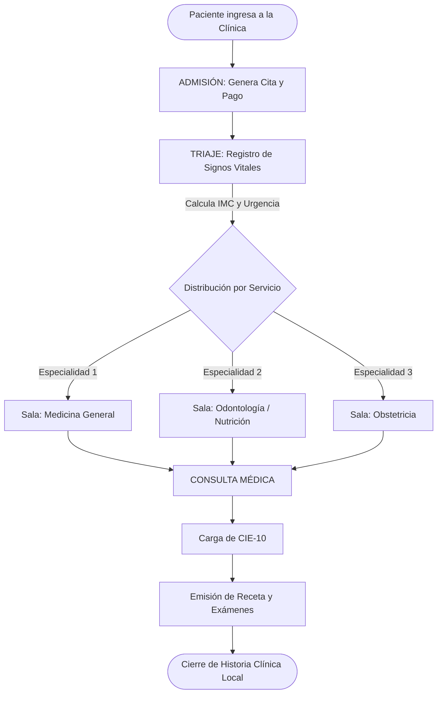
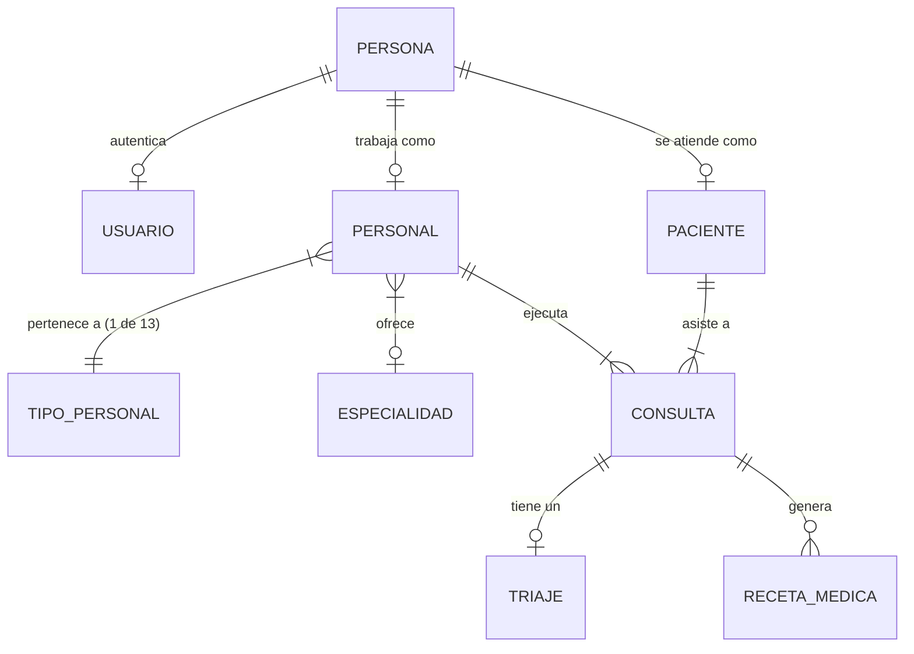

# 🏥 SIGECLIN - Arquitectura, Lógica y Flujo del Sistema

Este documento consolida la arquitectura, reglas de negocio y los flujos clínicos desarrollados hasta la fecha para el Sistema de Gestión Clínica **SIGECLIN**, construido sobre Java Spring Boot 3, Hibernate y PostgreSQL.

---

## 1. Módulos Core y Procesos del Sistema

El sistema está diseñado en una arquitectura monolítica con alta cohesión y bajo acoplamiento, separado en los siguientes dominios:

### A. Módulo de Filiación (Recursos Humanos e Identidad)
* **Gestión de Pacientes:** 
  - *Proceso:* Unificación de datos demográficos.
  - *Regla:* Un paciente = Una Historia Clínica (HC) universal e irrepetible.
* **Gestión de Personal:** 
  - *Proceso:* Control del ciclo de vida del trabajador clínico y administrativo.
  - *Integridad:* Solo el personal en `estado_laboral = 'activo'` puede ser programado. 
  - *Catálogo Estricto:* Soportado por 13 Tipos de Personal oficiales inmutables: `ADMISION`, `CAJA`, `TRIAJE`, `ENFERMERIA`, `MEDICINA GENERAL`, `OBSTETRICIA`, `ODONTOLOGIA`, `PSICOLOGIA`, `NUTRICION`, `LABORATORIO`, `FARMACIA`, `ADMIN`, `SUPERADMIN`.
* **Seguridad y Permisos:** 
  - *Proceso:* Asignación automática de cuentas (`username` autogenerado y contraseñas cifradas con `BCrypt`).
  - *Autorización:* Rutas Spring MVC protegidas por `@PreAuthorize` según el rol específico (Ej: Solo un `MEDICO_GENERAL` puede emitir Recetas).

### B. Módulo Clínico (Workflow de Atención)
Sigue un diseño en cascada unidireccional:

1. **Admisión:** Creación del registro (Ticket) vinculando al Paciente con un Servicio Clínico específico (Ej: Odontología). El estado inicial de la consulta es `PENDIENTE`.
2. **Triaje:** 
   - *Proceso:* Ingreso de parámetros biométricos (Presión arterial, FC, FR, Saturación, Peso, Talla). 
   - *Funciones Clave:* Cálculo automático del IMC, clasificación nutricional y de urgencia.
   - *Transición:* La consulta pasa a `EN_ESPERA` y aparece dinámicamente en la pantalla del médico especialista.
3. **Consulta Médica (Atención Integral):**
   - *Proceso:* El médico recibe al paciente, redacta los motivos (Anamnesis) y genera diagnósticos.
   - *Catálogo CIE-10:* Buscador inteligente de diagnósticos internacionales cargado en memoria RAM (Caché).
   - *Transición:* Al emitir las órdenes, la consulta se cierra y pasa a estado `ATENDIDO`.
4. **Emisiones Clínicas:** Generación de Recetas Médicas, Órdenes de Laboratorio y Exámenes Auxiliares con llaves foráneas ligadas permanentemente al médico que las ordenó.

---

## 2. Diagramas de Flujo del Sistema

### Workflow de Atención Clínica

### Relación de Base de Datos Principal

---

## 3. Resoluciones Arquitectónicas Críticas (Implementadas)

Durante el desarrollo se establecieron mecanismos de protección ('Safety Nets') para garantizar la solidez de los datos:

1. **Fallback Inteligente y Filtro de Especialidad:**
   * **Problema:** El sistema asignaba a "Administrativos" o "Ingenieros" como médicos tratantes de forma aleatoria por un error en la capa de persistencia (JPA).
   * **Solución:** Refactorización de `ConsultaService.java`. El algoritmo ahora busca dinámicamente en la base de datos a un profesional que cumpla dos condiciones: `estado_laboral = 'activo'` y cuyo `id_especialidad` coincida matemáticamente con la especialidad requerida por el paciente.

2. **Inyección de Dependencias Limpia en Vistas (Thymeleaf dinámico):**
   * **Problema:** Los menús desplegables (Select) en el HTML (`personal_lista.html`) poseían datos "quemados" (estáticos), imposibilitando la actualización del sistema.
   * **Solución:** Inyección del componente `JdbcTemplate` en `PersonalController` para empujar listas tipo `Map<Integer, String>` hacia el Front-end, logrando que si en un futuro se crea el tipo "RADIOLOGIA" en la BD, la pantalla lo renderice en tiempo real sin requerir una sola línea extra de código.

3. **Protección Transaccional Inversa (DataFixRunner y Seeder):**
   * **Problema:** Existencia de "Médicos Fantasmas" y personal inactivo saturando la BD y corrompiendo historiales.
   * **Solución:** Ejecución de "Hard Deletes" estructurados. Eliminación en cascada manual (Tabla Hija -> Tabla Padre: `Roles -> Personal -> Usuario -> Persona`).
   * **Prevención:** Migración (Update) automática de las `recetas_medicas`, `consultas` y `triajes` generados por el personal de prueba hacia el perfil de Medicina General principal, impidiendo errores de tipo `Foreign Key Constraint Violation` y transacciones abortadas en PostgreSQL.
