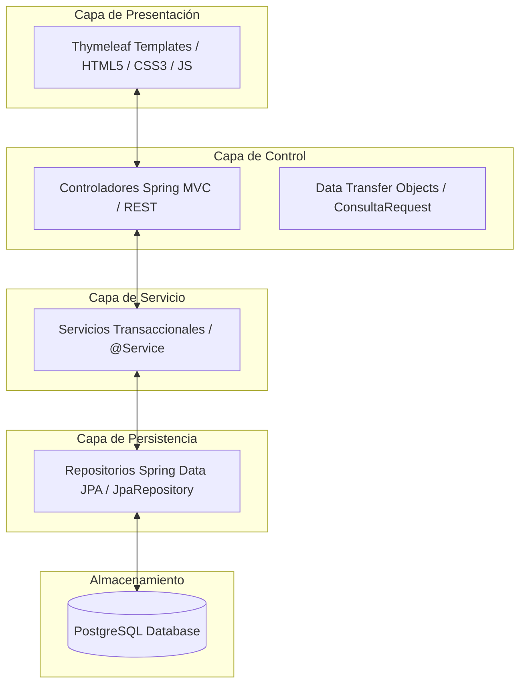
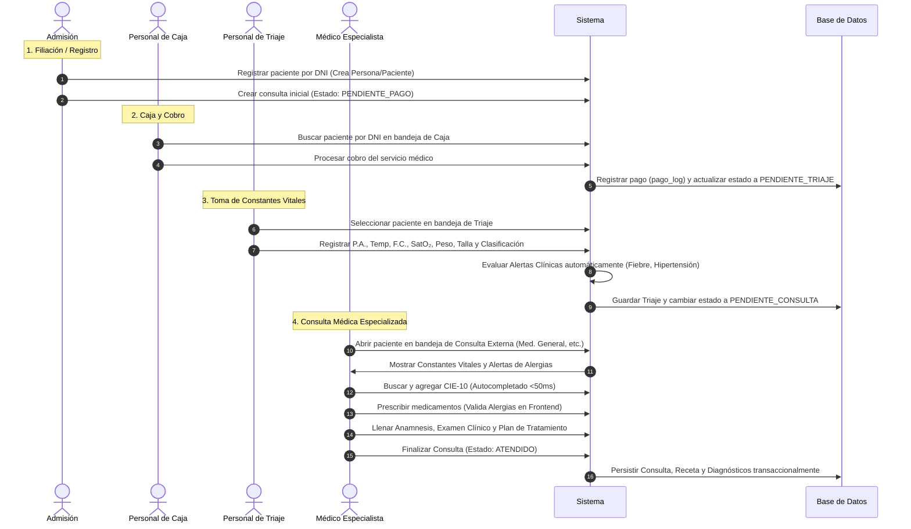

# 📘 Lógica, Flujo y Procesos del Sistema - SIGECLIN

Este documento técnico detalla de manera integral la arquitectura de software, los flujos transaccionales clínicos, las funciones de negocio frontend y backend, y las buenas prácticas implementadas en el sistema **SIGECLIN** (Sistema de Gestión Clínica) para el Centro de Salud CLAS Grocio Prado.

---

## 🏛️ 1. Arquitectura y Capas del Sistema (Desacoplamiento)

SIGECLIN se construye bajo una **Arquitectura Multicapa (Layered Architecture)**, utilizando el framework **Spring Boot 3.2.5** en Java 17, con persistencia relacional en **PostgreSQL v16/v18** y renderizado de plantillas mediante **Thymeleaf**.

1.  **Presentación (V):** Plantillas dinámicas de Thymeleaf que generan interfaces responsivas con Bootstrap 5, mejoradas estéticamente con un diseño **Glassmorphic** (paneles translúcidos, desenfoque de fondo y sombras suaves) mediante `main.css`.
2.  **Control (C):** Controladores tradicionales (`@Controller`) que gestionan la navegación de vistas y controladores REST (`@RestController`) que procesan peticiones asíncronas basadas en JSON.
3.  **Servicio (M - Lógica):** Componentes `@Service` que encapsulan la lógica de negocio clínica (validaciones, transacciones ACID, etc.).
4.  **Persistencia (M - Datos):** Repositorios Spring Data JPA y entidades mapeadas con Hibernate para la persistencia transaccional en PostgreSQL.

---

## 🔄 2. Flujo Completo del Paciente (Workflow Clínico)

El recorrido transaccional de un paciente en SIGECLIN se rige por un **Diagrama de Estados del Paciente** (`PENDIENTE_PAGO` ➔ `PENDIENTE_TRIAJE` ➔ `PENDIENTE_CONSULTA` ➔ `ATENDIDO`):

---

## ⚙️ 3. Detalle de Procesos y Funciones Técnicas

### 📂 A. Registro de Filiación (Herencia JOINED)
*   **Lógica:** Para evitar la duplicidad de datos comunes (DNI, nombres, apellidos, teléfono, correo), se implementó una jerarquía relacional mediante la estrategia `@Inheritance(strategy = InheritanceType.JOINED)`.
*   **Esquema:** La tabla `filiacion.persona` almacena los datos comunes, mientras que `filiacion.paciente` y `filiacion.personal` heredan de ella y almacenan campos específicos (Nro. de Historia Clínica para paciente; Nro. de Colegiatura/Especialidad para personal).

### 💳 B. Caja y Log de Pagos Directo
*   **Lógica:** Al realizar un cobro por la atención médica, el sistema ejecuta una inserción directa y transaccional en la tabla `clinico.pago_log` mediante JDBC/JPA para auditorías de recaudación, actualizando el estado de la consulta a `PENDIENTE_TRIAJE` de manera inmediata.

### 🩺 C. Triaje y Algoritmo de Alertas Clínicas
*   **Lógica:** Al ingresar los parámetros fisiológicos, el servicio evalúa de forma algorítmica las constantes del paciente para clasificarlo:
    *   **IMC:** $\text{IMC} = \frac{\text{Peso (kg)}}{\text{Talla (m)}^2}$ (clasifica en Bajo Peso, Saludable, Sobrepeso u Obesidad).
    *   **Alertas Clínicas:** Detecta en tiempo real:
        *   *Presión Arterial:* Hipertensión Crítica ($\ge 140/90$) o Prehipertensión ($\ge 120/80$).
        *   *Temperatura:* Fiebre ($\ge 38.0^\circ\text{C}$) o Hipotermia ($< 35.0^\circ\text{C}$).
        *   *Saturación:* Hipoxia / Dificultad Respiratoria ($< 95\%$).

### 🔍 D. Consulta Médica en 3 Columnas y Buscador CIE-10 con Caché
*   **Diseño Visual:** Interfaz Premium de alta densidad estructurada en 3 columnas independientes para evitar el scroll del navegador:
    *   **Columna 1 (Estado):** Constantes del Triaje actual y advertencia animada de Alergias Activas del Paciente.
    *   **Columna 2 (Registro):** Pestañas de Anamnesis, Examen Físico, Plan de Tratamiento y Línea de Tiempo del Historial Médico del paciente.
    *   **Columna 3 (Prescripción):** Buscador de diagnósticos CIE-10, prescripción de fármacos y emisión de órdenes de laboratorio.
*   **Buscador CIE-10:** Se implementó una API REST asíncrona (`Cie10RestController`) optimizada con un catálogo precargado de 389 códigos de la Organización Mundial de la Salud (OMS). Utiliza caché en memoria para retornar sugerencias en menos de **50ms**.

### 🚫 E. Validación Interactiva de Alergias (Frontend & Backend)
*   **Seguridad Clínica:** Al presionar "Agregar a Receta", un script de validación cruza en tiempo real el fármaco seleccionado por el médico contra la lista de alergias activas del paciente. Si hay una coincidencia (ej. Penicilina), el sistema **bloquea la adición** en el popup de SweetAlert con una advertencia visible, evitando errores antes del envío al servidor.
*   **Capa de Negocio:** En caso de burlar el frontend, la capa `@Service` realiza una validación redundante arrojando `AlergiaActivaException` para evitar la persistencia del fármaco peligroso.

### 🖨️ F. Impresión Limpia de Documentos Clínicos
*   **Lógica:** Para la emisión de Recetas, Certificados Médicos y Hojas de Referencia, se diseñaron plantillas HTML independientes con reglas de impresión CSS (`@media print`):
    *   Oculta de forma automática los botones de acción, menús de navegación y cabeceras del sistema.
    *   Ajusta el contenido para imprimir de forma óptima en formato A4 físico.
    *   Implementa la función JS `openCenteredPopup()` para calcular matemáticamente las coordenadas y abrir la ventana de impresión exactamente al centro del monitor del médico.

### 📊 G. Exportación de Datos a Excel Real (Apache POI)
*   **Lógica:** El sistema no genera archivos de texto CSV con formato renombrado. Utiliza la biblioteca **Apache POI** para construir un libro binario de Excel real (`.xlsx`) mediante `XSSFWorkbook`.
*   **Detalle:** El archivo exporta de forma jerárquica las columnas de Pacientes, Historias Clínicas y Fechas de Registro formateadas profesionalmente para auditorías administrativas.

---

## 🌟 4. Buenas Prácticas de Ingeniería de Software Aplicadas

1.  **Inyección de Dependencias por Constructor (IoC):** Se evita el uso de `@Autowired` directo sobre campos de clase. La inyección se realiza a través de constructores parametrizados, facilitando las pruebas unitarias y garantizando la inmutabilidad de los servicios.
2.  **Principio de Inversión de Dependencia (DIP):** Los controladores de presentación inyectan interfaces de servicio y no implementaciones concretas, facilitando el intercambio de lógica de datos.
3.  **Encapsulamiento con DTOs:** Transferencia segura de payloads mediante clases DTO estructuradas (como `ConsultaRequest`), aislando la base de datos de los datos capturados en el frontend.
4.  **Logging Profesional (SLF4J / Logback):** Registro y trazabilidad de eventos y excepciones a través del Logger corporativo, prohibiendo por completo el uso de `System.out.println` o `e.printStackTrace()`.
5.  **Pruebas Automatizadas (JUnit y Jacoco):** Cobertura del código fuente y suite de **46 pruebas unitarias/integración** aprobadas que validan el correcto funcionamiento del sistema.
