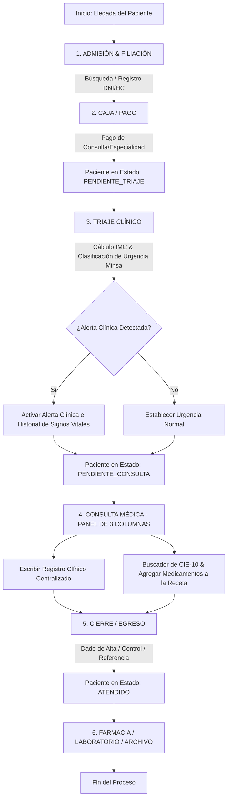

# 🏥 SIGECLIN: Lógica, Flujos y Arquitectura del Sistema

Esta documentación proporciona una visión técnica completa de la arquitectura, flujos de procesos, lógica de negocio y endpoints del sistema **SIGECLIN** (Sistema de Gestión Clínica Hospitalaria) hasta el estado actual del desarrollo.

---

## 📌 1. Introducción al Sistema
**SIGECLIN** es una plataforma web moderna y robusta diseñada para clínicas y hospitales que optimiza la ruta asistencial del paciente desde su llegada hasta su egreso. El sistema destaca por una **interfaz premium con diseño glassmorphism** fluida, reactiva y optimizada para evitar espacios vacíos en cualquier resolución de pantalla, integrando seguridad, auditoría y alertas clínicas avanzadas.

---

## 🛠️ 2. Arquitectura Técnica y Stack Tecnológico

El sistema está construido bajo una arquitectura multicapa (Controller-Service-Repository-Model) robusta:

```
[ FRONTEND ] Thymeleaf + Bootstrap 5 + Vanilla JS + Premium CSS (v=3.2)
     │
     ▼
[ CONTROLLER ] Capa Spring MVC / API REST Controllers
     │
     ▼
[ SERVICES ] Capa de Lógica de Negocio (ConsultaService, TriajeService, etc.)
     │
     ▼
[ REPOSITORIES ] Spring Data JPA (ConsultaRepository, PacienteRepository, etc.)
     │
     ▼
[ BASE DE DATOS ] PostgreSQL / H2 Database (con Caché In-Memory para CIE-10)
```

### Tecnologías Clave:
* **Backend:** Spring Boot, Spring Security (Autenticación y Autorización basada en roles), Spring Data JPA.
* **Frontend:** Thymeleaf (motor de plantillas), HTML5 Semántico, Bootstrap 5.3.2, Bootstrap Icons y Custom CSS (con variables CSS armonizadas en HSL, microanimaciones y efectos de translucidez).
* **Gestión de Dependencias:** Maven.
* **Base de Datos:** Hibernate ORM para la persistencia + motor relacional compatible con restricciones Check Constraints de integridad.

---

## 🔄 3. Flujo del Proceso Clínico (Workflow)

El flujo de atención sigue una secuencia estricta basada en el estado del paciente para asegurar un seguimiento clínico estructurado:



### Estados del Paciente en su Ruta Asistencial:
1. **PENDIENTE_TRIAJE:** Paciente registrado y derivado tras su pago en admisión/caja.
2. **PENDIENTE_CONSULTA:** Paciente triado (constantes registradas) y a la espera de consulta médica en el módulo derivado.
3. **ATENDIDO:** Paciente atendido por el médico especialista, con su receta registrada y listo para farmacia o egreso.

---

## 🗂️ 4. Estructura de Módulos, Clases y Repositorios

El código fuente está estructurado de manera modular para garantizar escalabilidad:

### A. Módulo Clínico (`com.sigeclin.clinico`)
Encargado de la lógica de triaje, consultas médicas, recetas y diagnósticos.

* **Entidades Clave:**
  * `Triaje`: Contiene constantes vitales (temperatura, peso, talla, IMC, frecuencia cardíaca, saturación de oxígeno, presión arterial sistólica y diastólica, clasificación de urgencia, alertas y observaciones).
  * `Consulta`: Registra la atención médica (motivo, anamnesis, examen físico, diagnóstico principal, plan y tratamiento, referencias y estado final de alta/control).
  * `AlergiaPaciente`: Administra alergias activas con su nivel de severidad (Leve, Moderada, Severa) asociadas a una alerta visual interactiva.
  * `RecetaMedica` y `DetalleReceta`: Controlan los medicamentos recetados por el profesional (dosis, duración, cantidad, código CIE-10 del diagnóstico asociado).
  * `AuditoriaAcceso`: Almacena registros para auditoría de accesos al sistema con fecha, hora y usuario.

* **Controladores (`controller`):**
  * `TriajeController`: Gestiona la derivación de especialidades, registro de constantes y clasificación según la norma técnica de salud.
  * `ConsultaController`: Centraliza el potente **Dashboard de Consulta** con su flujo de API REST de recetas, diagnósticos y finalización.
  * `ApoyoDiagnosticoController`: Visualizaciones y colas de laboratorio y exámenes auxiliares.
  * `CajaController`: Registro de pagos y emisión de comprobantes.

* **Servicios (`service`):**
  * `ConsultaService`: Lógica transaccional para el almacenamiento unificado de la consulta junto con la receta médica (`guardarConsultaCompleta`).
  * `TriajeService`: Operaciones sobre constantes e historial de signos vitales.
  * `AuditoriaService`: Registra acciones del usuario de forma transparente.

---

## 🧮 5. Algoritmos y Lógica Especializada del Sistema

### A. Algoritmo de Triage y Reglas de Alerta Clínica (Minsa/EsSalud)
Durante el triaje clínico, el sistema analiza las constantes vitales e identifica estados de riesgo de forma proactiva:
1. **Cálculo Automático del IMC:** 
   $$\text{IMC} = \frac{\text{Peso (kg)}}{\text{Talla (m)}^2}$$
   * Si $\text{IMC} \ge 30$, se marca como "Obesidad / Alerta".
   * Si $\text{IMC} \ge 25$, se marca como "Sobrepeso".
2. **Presión Arterial:** 
   * Sistólica $\ge 140$ o Diastólica $\ge 90$ $\rightarrow$ Alerta de **Hipertensión**.
   * Sistólica $< 90$ o Diastólica $< 60$ $\rightarrow$ Alerta de **Hipotensión**.
3. **Frecuencia Cardíaca:** 
   * $> 100\text{ bpm} \rightarrow$ Alerta de **Taquicardia**.
   * $< 60\text{ bpm} \rightarrow$ Alerta de **Bradicardia**.
4. **Saturación de Oxígeno:** 
   * $< 95\% \rightarrow$ Alerta de **Hipoxia**.
5. **Temperatura:** 
   * $\ge 38.0^\circ\text{C} \rightarrow$ Alerta de **Estado Febril**.
   * $< 35.5^\circ\text{C} \rightarrow$ Alerta de **Hipotermia**.

---

### B. Carga In-Memory y Autocompletado Reactivo de CIE-10 (CIE-X)
Para ofrecer una experiencia de búsqueda instantánea y evitar sobrecargar la base de datos relacional durante la digitación médica, se implementó un sistema de **caché en memoria**:

1. **Carga en Post-Construct:**
   Al arrancar la aplicación (`@PostConstruct` en `ConsultaController`), el sistema lee los archivos CSV de diagnósticos (`diagnosticos_cie10.csv`, etc.) ubicados en `d:\UTP\SISTEMAS\AEAMAN\ciex`.
2. **Normalización UTF-8:**
   Los archivos se abren explícitamente en UTF-8 para conservar acentos y caracteres de la nomenclatura médica.
3. **Búsqueda Instantánea REST / Autocompletado JS:**
   * El endpoint `/consulta/api/cie10/search?q=...` realiza búsquedas insensibles a mayúsculas/minúsculas comparando el código o la descripción en la memoria en milisegundos.
   * En el frontend, el input `cie10Search` actualiza reactivamente la lista de sugerencias flotante `cie10Results`. Al seleccionar un ítem, el objeto se enlaza al modelo de diagnóstico actual (`selectedDx`), asegurando la integridad referencial antes de agregar medicamentos.

---

### C. Alertas de Alergias Activas en UI
* El sistema consulta en base de datos si el paciente registra alergias.
* Si el paciente presenta alergias, se muestra una caja de alerta roja con la animación interactiva `.animate-pulse` (un sutil parpadeo de opacidad) que advierte de inmediato al médico antes de prescribir fármacos.

---

### D. Diseño UI Premium: Auto-estiramiento Flexible sin Espacios Muertos
Para garantizar que la pantalla luzca espectacular ("WOW factor") y sin espacios vacíos ni desbordamientos toscos, la interfaz de consulta médica (3 columnas) implementa una estructura de **Flexbox vertical fluido**:

1. **Columna 1 (Estado Clínico):**
   * Ajustada con `overflow-hidden` para desterrar los scrolls.
   * Utiliza `d-flex flex-column justify-content-between` dividida en tres grandes contenedores: Signos vitales en la parte superior, Alertas en la del medio y Observaciones de Triaje acopladas en la base del card.
2. **Columna 2 (Registro Clínico):**
   * Configurada como contenedor flex vertical de alto completo.
   * Las cajas de texto de **Anamnesis, Examen Físico y Plan y Tratamiento** tienen asignada la clase `flex-grow-1` dentro de contenedores flexibles. Esto permite que las áreas de escritura se estiren automáticamente para llenar el 100% de la altura vertical de la columna central, eliminando cualquier espacio en blanco inferior independientemente del tamaño del monitor del médico.
3. **Columna 3 (Atención & Recetario):**
   * Se eliminó el fondo gris redundante y los bordes internos dobles para acoplar la interfaz directamente en fondo blanco limpio.
   * Los botones de **Finalizar Consulta** e **Imprimir** se ubican de forma estricta en el pie de tarjeta (`card-footer`), permitiendo que el visor de medicamentos agregados crezca libremente mediante `flex-grow-1` con un scroll bar personalizado ultrafino (`custom-scrollbar`).

---

## 🔌 6. Endpoints y APIs Clave del Sistema

El sistema expone endpoints MVC y API REST altamente optimizados para la interacción asíncrona:

| Método | Endpoint | Parámetros | Descripción | Retorno |
| :--- | :--- | :--- | :--- | :--- |
| **GET** | `/consulta/modulo/{nombreModulo}` | `nombreModulo` (Path) | Carga la cola de espera de pacientes para una especialidad (Medicina General, Pediatría, etc.) | HTML (`clinico/consulta_cola`) |
| **GET** | `/consulta/atender/{idTriaje}` | `idTriaje` (Path) | Carga los datos clínicos, constantes e historial completo en el Dashboard de 3 columnas para la atención activa | HTML (`clinico/consulta_espera`) |
| **GET** | `/consulta/api/cie10/search` | `q` (Query) | Realiza búsquedas de diagnósticos CIE-10 contra la caché en memoria del backend | JSON (`List<Cie10>`) |
| **GET** | `/consulta/api/detalle/{id}` | `id` (Path) | Retorna los detalles JSON completos de una consulta previa para la visualización del historial en tiempo de ejecución | JSON (`ResponseEntity<Consulta>`) |
| **POST**| `/consulta/guardar` | `@RequestBody Map` | Finaliza la consulta, procesa diagnósticos, asocia medicamentos, guarda la Receta en la DB y actualiza el estado del paciente a **ATENDIDO** | JSON (`success: true, message: ...`) |
| **GET** | `/triaje/nuevo` | `hc` (Opcional Query) | Muestra el panel de búsqueda e inicio de triaje de pacientes en espera | HTML (`clinico/triaje_busqueda`) |
| **POST**| `/triaje/guardar` | `@ModelAttribute Triaje`| Registra el triaje, activa alertas clínicas según los umbrales de constantes y deriva al paciente a **PENDIENTE_CONSULTA** | Redirección (`/triaje/nuevo`) |

---

## 📈 7. Próximos Pasos para la Evolución del Sistema
1. **Firma Digital del Médico:** Acoplamiento de la firma digital e historial transaccional encriptado de recetas.
2. **Sincronización Automática con Farmacia:** Notificación en tiempo real (mediante WebSockets o SSE) para el despacho asíncrono de medicamentos al momento de dar click en **FINALIZAR CONSULTA**.
3. **Módulo de Exámenes de Laboratorio en 3D:** Integración del visor interactivo 3D para bitácoras clínicas y reportes anatómicos detallados.