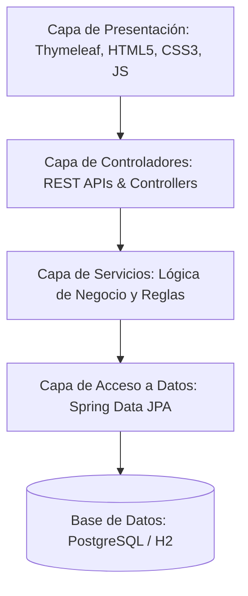
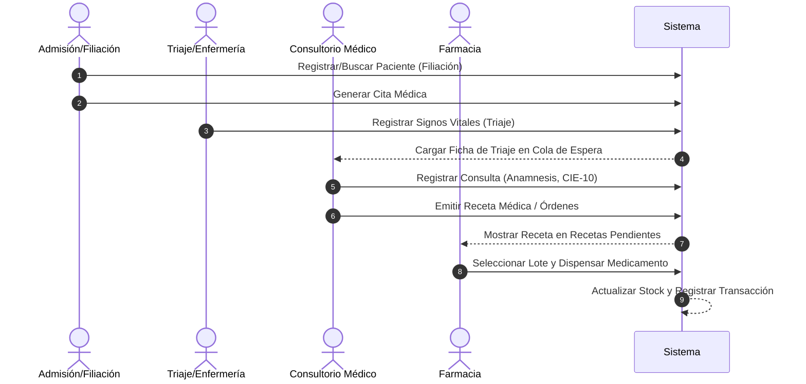

# 🏥 SIGECLIN GP - Documentación de Lógica, Flujo y Procesos del Sistema

Esta documentación describe la arquitectura, la lógica de negocio, los flujos de procesos y las funciones clave implementadas hasta la fecha en el sistema de gestión clínica **SIGECLIN GP**.

---

## 📌 1. Arquitectura General del Sistema

El sistema sigue una arquitectura monolítica modular en capas, desarrollada sobre **Spring Boot 3.2.5** y estructurada de la siguiente manera:

- **Controladores (`controller`)**: Manejan las peticiones HTTP, gestionan el enrutamiento Thymeleaf y las respuestas REST en formato JSON.
- **Servicios (`service`)**: Centralizan las reglas de negocio, validaciones y orquestación de transacciones.
- **Repositorios (`repository`)**: Utilizan interfaces de Spring Data JPA con consultas personalizadas y especificaciones dinámicas (`Specification`) para búsquedas complejas.
- **Modelos (`model`)**: Entidades JPA que representan las tablas en PostgreSQL, utilizando herencia unida (`JOINED`) para la relación entre `Persona` y `Usuario`/`Personal`.

---

## 🔄 2. Flujo de Atención Clínica Principal

El flujo de atención de un paciente en SIGECLIN sigue una secuencia lógica diseñada para garantizar la integridad de los datos clínicos desde el ingreso hasta el tratamiento.

### Detalle de las Etapas:

1. **Admisión y Filiación**:
   - Registro de datos demográficos y de contacto del paciente.
   - Creación de la historia clínica.
   - Envío a la cola de espera de consulta.

2. **Módulo de Triaje**:
   - Captura de signos vitales obligatorios: presión arterial, temperatura, frecuencia cardíaca, peso y talla.
   - **Lógica de Negocio**: Cálculo automático del Índice de Masa Corporal (IMC) y diagnóstico preliminar de peso:
     $$\text{IMC} = \frac{\text{Peso (kg)}}{\text{Talla (m)}^2}$$
   - Registro de sintomatología general y derivación al especialista.

3. **Consulta Médica (Acto Médico)**:
   - Visualización de antecedentes del paciente y datos de triaje.
   - Registro de anamnesis, examen físico y notas médicas.
   - Asignación de diagnósticos oficiales mediante el catálogo curado **CIE-10** (más de 100k registros cargados de forma eficiente en memoria).
   - Generación de órdenes de apoyo al diagnóstico (Laboratorio/Imágenes) y emisión de **Receta Médica** con estado `pendiente`.

4. **Gestión de Farmacia**:
   - Listado en tiempo real de recetas con estado `pendiente` o `parcial`.
   - Visualización de lotes de medicamentos ordenados por fecha de vencimiento (`fechaVencimiento ASC`) para cumplir con la lógica FIFO (First In, First Out).
   - **Proceso de Dispensación**: Descuenta el stock físico del lote seleccionado y actualiza el estado de la receta (`parcial` o `entregado`) con registro de auditoría del usuario que despensa.

---

## ⚙️ 3. Procesos y Funciones por Módulo

### A. Módulo de Farmacia (`FarmaciaService`)
Este módulo se encarga del control de inventario de medicamentos y el flujo de dispensación.

- **`getRecetasPendientes()`**: Obtiene todas las recetas cuyo estado de dispensación no sea `entregado`. Agrupa los ítems por paciente y receta para mostrarlos de forma compacta en la interfaz.
- **`getLotesDisponibles(idMedicamento)`**: Retorna los lotes activos con stock (`stockActual > 0`) ordenados por vencimiento para evitar mermas.
- **`dispensar(idDetalleReceta, idLote, cantidad, observaciones, idUsuario)`**:
  - Valida la existencia del lote y del ítem de la receta.
  - Verifica si la fecha de vencimiento es posterior al día actual.
  - Comprueba la disponibilidad de stock.
  - Descuenta el stock del lote y genera un registro en la tabla `Dispensacion`.
  - Determina si la entrega cubre la totalidad solicitada para marcar el ítem como `parcial` o `entregado`.
- **`getAlertas()`**: Genera reportes en tiempo real de:
  - **Stock Bajo**: Lotes con menos de 10 unidades disponibles.
  - **Próximos a Vencer**: Lotes cuya fecha de vencimiento está a menos de 30 días.
- **`crearLote(LoteRequest, idUsuario)`**: Registra un nuevo lote en el catálogo verificando duplicidad de código.

### B. Módulo de Laboratorio (`LaboratorioService`)
Permite el seguimiento de exámenes auxiliares solicitados por el médico.

- **`registrarOrden(OrdenMedicaRequest)`**: Registra los exámenes solicitados y los asocia a la consulta del paciente.
- **`subirResultados(idOrden, archivoPDF, observaciones)`**: Almacena el resultado digitalizado de los exámenes y marca la orden como `finalizada` para que el médico pueda revisarla en la historia del paciente.

### C. Módulo de Seguridad y Cifrado
Aplica estándares modernos para la protección de datos sensibles.

- **Rate Limiting**: Filtro que limita los intentos fallidos de inicio de sesión para mitigar ataques de fuerza bruta.
- **Cookies de Sesión Seguras**: Configuración de `SameSite=Strict`, `HttpOnly` y `Secure` para evitar ataques XSS y robo de tokens de sesión.
- **Cifrado de Datos**: Uso de `CryptoConverter` con cifrado AES-256 para proteger campos críticos del paciente en la base de datos.
- **Auditoría Envers**: Registro automatizado de cambios en las tablas del sistema (tablas `*_aud`), permitiendo la reconstrucción del historial de modificaciones médicas.

---

## 📈 4. Calidad del Código y Pruebas Unitarias

SIGECLIN GP cuenta con un pipeline de calidad validado mediante **SonarQube**, asegurando el cumplimiento de las siguientes métricas:

- **Cobertura de Código (Code Coverage)**: $\ge 81.3\%$ de cobertura en el código nuevo desarrollado (con pruebas Mockito que abarcan el 100% de la lógica en `FarmaciaService`).
- **Issues y Code Smells**: $0$ violaciones críticas de estilo o seguridad.
- **Duplicación de Código**: $0.0\%$ de código duplicado en nuevas implementaciones, mediante el uso de constantes centralizadas para mapeo de claves e identificadores.

### Buenas Prácticas de Testing Aplicadas:
- Eliminación de dependencias dinámicas del sistema (`LocalDate.now()`) en tests, sustituyéndolas por fechas fijas usando el enum `java.time.Month` para garantizar pruebas 100% deterministas y no fluctuantes.
- Mocking estricto de repositorios mediante `@ExtendWith(MockitoExtension.class)`.
