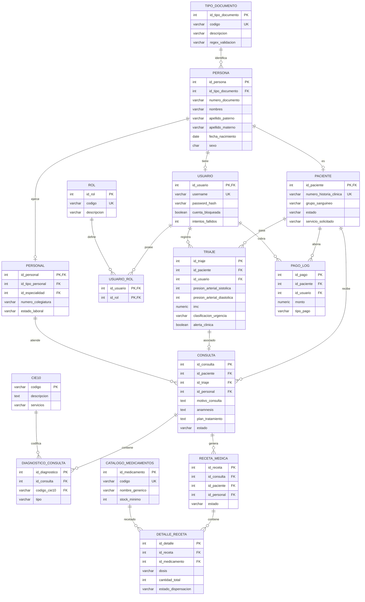

# 🗄️ Diseño de Base de Datos - Modelo Entidad-Relación y Seguridad (Lineamientos Unidad 2)

Este documento detalla el diseño de persistencia de **SIGECLIN**, describiendo su estructura de datos física y lógica, las relaciones clave, el diagrama de base de datos modelado en Mermaid, y las consideraciones de seguridad implementadas a nivel de base de datos relacional (PostgreSQL).

---

## 📊 1. Diagrama Entidad-Relación (DER) Físico

El siguiente diagrama modela la base de datos dividida por esquemas (`filiacion`, `clinico`, `maestras`, `seguridad`), detallando sus atributos, tipos de datos y relaciones de cardinalidad:



---

## 🔒 2. Seguridad en la Base de Datos

El diseño de persistencia implementa múltiples salvaguardas para proteger la confidencialidad médica (HIPAA/Ley General de Salud del Perú N° 26842):

### A. Segregación de Roles de Conexión (Least Privilege)
La aplicación web Spring Boot no se conecta a PostgreSQL como superusuario (`postgres`), sino mediante el rol restringido `admin` creado en caliente durante la inicialización:
```sql
CREATE USER admin WITH PASSWORD 'admin';
GRANT ALL PRIVILEGES ON DATABASE sigeclin TO admin;
```
Este usuario solo tiene acceso a las tablas dentro de los esquemas específicos de SIGECLIN y no puede alterar configuraciones críticas del servidor de base de datos ni acceder a otras bases de datos de la organización.

### B. Cifrado de Contraseñas (Hashing con BCrypt)
Las contraseñas de los usuarios no se almacenan nunca en texto plano. Se utiliza la función de derivación de claves robusta `BCryptPasswordEncoder` en la capa de servicios antes de persistir en `filiacion.usuario(password_hash)` con un factor de costo de 10.

### C. Auditoría Activa de Accesos Clínicos
Se registran de forma automática las operaciones sensibles en la tabla `clinico.auditoria_acceso`, capturando la identidad del usuario, su dirección IP de origen (`request.getRemoteAddr()`), la acción (p. ej., "CONSULTA_HISTORIA_CLINICA") y el paciente relacionado, permitiendo reconstruir rastros forenses en caso de fugas de información.

---

## 📈 3. Mejores Prácticas de Diseño y Rendimiento

1. **Normalización en Tercera Forma Normal (3NF)**: Las tablas de negocio clínico evitan la redundancia de datos. La información de contacto, identificación y filiación está unificada en `filiacion.persona`, y es heredada mediante el tipo de mapeo `InheritanceType.JOINED` de JPA a nivel físico.
2. **Índices de Alto Rendimiento**:
   - `idx_persona_nombres`: Indexa `apellido_paterno`, `apellido_materno` y `nombres` para agilizar la búsqueda de pacientes en admisión.
   - `idx_cie10_descripcion`: Índice GIN de búsqueda de texto completo en español (`to_tsvector`) sobre las descripciones CIE-10 para agilizar el buscador de diagnósticos del médico.
3. **Vista Materializada para Historias Clínicas**:
   La vista materializada `clinico.vw_historia_clinica` unifica los datos de filiación, el último triaje y si el paciente presenta alergias en un único registro físico indexado. Se refresca de forma asíncrona reduciendo a cero el sobrecosto de realizar múltiples `JOIN` complejos al cargar el historial clínico de pacientes frecuentes.
