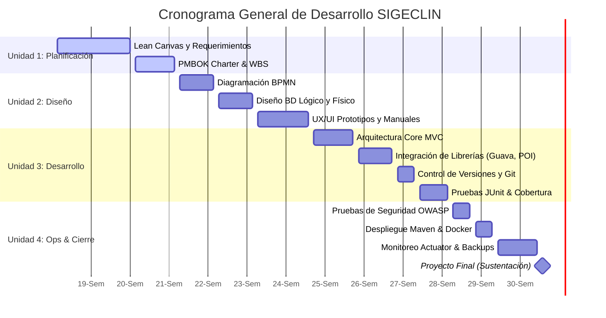

# 📈 Planificación y Dirección de Proyecto - SIGECLIN (Lineamientos PMBOK & Lean Canvas)

Este documento compila el diseño de planificación, dirección de proyecto y requerimientos iniciales según los lineamientos de la **Unidad 1 y 2** del sílabo del curso, alineando el desarrollo del sistema **SIGECLIN** con las metodologías ágiles y el estándar PMBOK.

---

## 🎨 1. Lienzo Lean Canvas (Lean Canvas Model)

El modelo de negocio y propuesta de valor iniciales para el desarrollo y adopción de SIGECLIN se estructuran a continuación:

| **1. Problema** | **4. Solución** | **3. Propuesta de Valor Única** | **9. Ventaja Injusta** | **2. Segmentos de Clientes** |
| :--- | :--- | :--- | :--- | :--- |
| • Historias clínicas de papel ineficientes, lentas e inseguras. • Falta de alertas en signos vitales (triaje) en tiempo real. • Tiempos de espera prolongados para citas y farmacia. • Pérdida de control de stock de medicamentos. | • Sistema de triaje con alertas visuales automáticas. • Panel médico integrado de 3 columnas para atención ágil. • Buscador optimizado en caché CIE-10. • Control y dispensación de recetas vinculado a stock real. | **SIGECLIN: La evolución clínica digital de alta velocidad.**  Plataforma clínica integrada que reduce a cero el uso del papel, calcula alertas de riesgo vital en triaje y optimiza el flujo completo de atención (Admisión ➔ Caja ➔ Triaje ➔ Consulta ➔ Farmacia) con latencia cero en búsquedas CIE-10. | • Arquitectura portable offline-first en caso de caídas de red local. • Algoritmos adaptados a normativas del MINSA (PNUME I-3). • Integración fluida de apoyo al diagnóstico (Laboratorio y Farmacia) sin recargar la BD. | • **Centros de Salud de Nivel I-3 y I-4** (Públicos o Privados) que buscan digitalizar su gestión. • Personal Administrativo (Caja/Admisión). • Profesionales de Salud (Médicos, Enfermeros, Obstetras). |
| **8. Métricas Clave** | | **5. Canales** | | |
| • **Tiempo promedio de atención** por paciente. • **Porcentaje de alertas de triaje** identificadas correctamente. • **Efectividad de entrega** de recetas en farmacia. • **Tasa de errores de medicación** (bloqueada por alertas de alergias). | | • Distribución directa B2B a clínicas y consultorios. • Demostraciones de portabilidad local en servidores locales. • Plataforma de soporte técnico remota (GitHub). | | |
| **7. Estructura de Costos** | | **6. Flujo de Ingresos** | | |
| • Costos de hosting y servidores locales/nube. • Honorarios del equipo de desarrollo de software (QA, Devs). • Costo de mantenimiento e integración de firmas digitales. • Capacitación al personal clínico y soporte post-despliegue. | | • Suscripción mensual SaaS por consultorio/módulo. • Licenciamiento local para centros de salud del MINSA. • Servicios premium de soporte, actualizaciones de CIE-10 y mantenimiento. | | |

---

## 📄 2. Acta de Constitución del Proyecto (Project Charter)

Estándar simplificado alineado a la guía PMBOK (Project Management Body of Knowledge):

### 2.1 Información General del Proyecto
* **Nombre del Proyecto:** Sistema Integrado de Gestión Clínica (SIGECLIN)
* **Patrocinador Principal:** Dirección General de Clínicas del Sector Salud UTP
* **Director del Proyecto (Project Manager):** MC Jair
* **Fecha de Inicio:** 11 de Mayo de 2026
* **Fecha de Entrega Final:** 18 de Julio de 2026 (Semana 18)

### 2.2 Business Case (Caso de Negocio)
Los centros de atención de nivel básico (I-3) experimentan retrasos en la atención ambulatoria debido a procesos de archivo manual de historias clínicas físicas y a la falta de comunicación entre el consultorio médico, el triaje y la farmacia. Esto resulta en diagnósticos tardíos y errores en la dispensación de recetas. **SIGECLIN** busca automatizar y conectar estos flujos, minimizando el tiempo de espera del paciente de 45 minutos a menos de 10 minutos promedio, y reduciendo a cero los errores humanos de dosificación o alertas de alergias.

### 2.3 Objetivos del Proyecto
1. **Funcional**: Automatizar los procesos de admisión, facturación (caja), triaje clínico con alertas MINSA, consulta externa (CIE-10 integrado), prescripción y farmacia.
2. **Desempeño**: Lograr que la búsqueda de diagnósticos CIE-10 en memoria tome menos de 50 milisegundos bajo cargas de concurrencia normal.
3. **Seguridad**: Asegurar la integridad de las Historias Clínicas restringiendo accesos a través de roles detallados (Spring Security) y logs de auditoría inmutables.
4. **Calidad**: Mantener una cobertura de pruebas unitarias superior al 10% mediante JUnit y Jacoco, y cero vulnerabilidades críticas detectadas mediante auditorías de seguridad automáticas (OWASP).

### 2.4 Alcance y Entregables Clave
* **INCLUYE**:
  - Módulo de Admisión (Filiación y generación de Historia Clínica única).
  - Módulo de Caja (Procesamiento de pagos y derivación automática).
  - Módulo de Triaje (Registro de constantes fisiológicas e identificación de alertas clínicas).
  - Módulo de Consulta Médica (Panel de 3 columnas, buscador de diagnósticos con caché Guava, recetario).
  - Módulo de Apoyo al Diagnóstico (Laboratorio clínico y dispensación de recetas en Farmacia).
  - Telemetría en tiempo real y logs del sistema.
* **NO INCLUYE**:
  - Integración directa con pasarelas de pago bancarias en vivo (se simula el flujo de Caja).
  - Facturación electrónica con SUNAT en vivo (se genera comprobante local representativo).

---

## 🪵 3. Estructura de Desglose de Trabajo (WBS - EDT)

La EDT divide el proyecto en entregables manejables en base a los lineamientos del sílabo:

```mermaid
graph TD
    WBS["1. Proyecto SIGECLIN"]
    
    P1["1.1 Iniciación & Análisis"]
    P1.1["1.1.1 Lean Canvas"]
    P1.2["1.1.2 Project Charter"]
    P1.3["1.1.3 Requerimientos (SRS)"]
    
    P2["1.2 Diseño del Sistema"]
    P2.1["1.2.1 Diagrama BPMN"]
    P2.2["1.2.2 Diseño BD (DER)"]
    P2.3["1.2.3 Prototipos UX/UI"]
    P2.4["1.2.4 Manual de Usuario"]
    
    P3["1.3 Desarrollo (Core)"]
    P3.1["1.3.1 Arquitectura MVC/DAO"]
    P3.2["1.3.2 Seguridad & Roles"]
    P3.3["1.3.3 Integración Guava & POI"]
    
    P4["1.4 Calidad & Pruebas"]
    P4.1["1.4.1 Pruebas Unitarias JUnit"]
    P4.2["1.4.2 Reporte Jacoco (TDD)"]
    P4.3["1.4.3 Análisis Seguridad OWASP"]
    
    P5["1.5 Despliegue & Cierre"]
    P5.1["1.5.1 Empaquetado Maven (JAR)"]
    P5.2["1.5.2 Contenedores Docker"]
    P5.3["1.5.3 Telemetría Actuator"]
    P5.4["1.5.4 Scripts de Backups"]
    
    WBS --> P1
    WBS --> P2
    WBS --> P3
    WBS --> P4
    WBS --> P5
    
    P1 --> P1.1
    P1 --> P1.2
    P1 --> P1.3
    
    P2 --> P2.1
    P2 --> P2.2
    P2 --> P2.3
    P2 --> P2.4
    
    P3 --> P3.1
    P3 --> P3.2
    P3 --> P3.3
    
    P4 --> P4.1
    P4 --> P4.2
    P4 --> P4.3
    
    P5 --> P5.1
    P5 --> P5.2
    P5 --> P5.3
    P5 --> P5.4
```

---

## 📅 4. Cronograma de Hitos y Diagrama de Gantt

El desarrollo cronológico del proyecto a lo largo de las 18 semanas de clase se plasma en el siguiente diagrama de Gantt:

