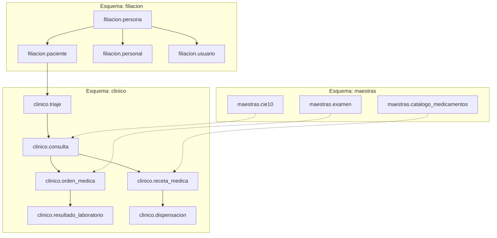
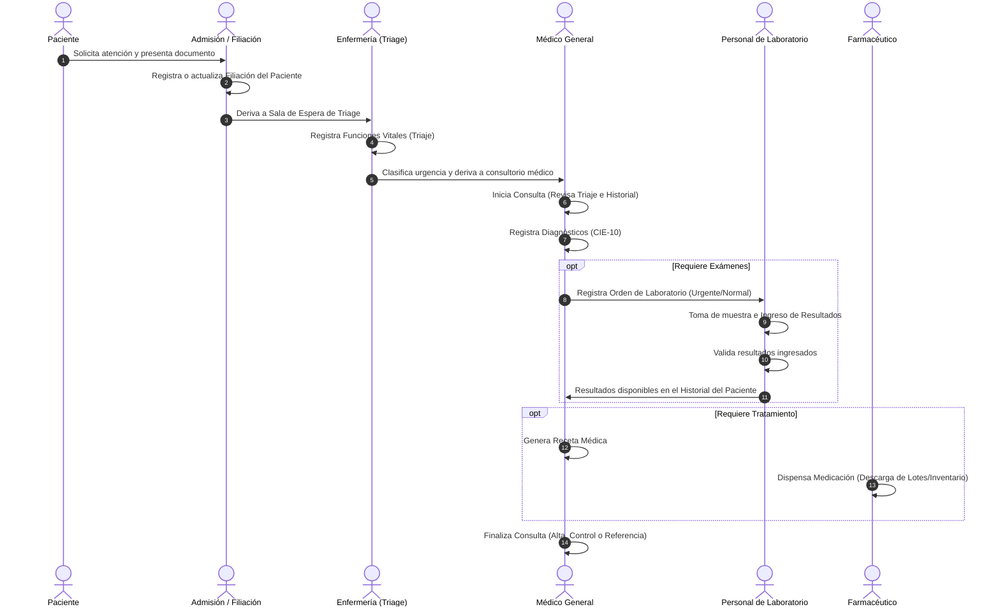

# Documentación de Lógica y Flujo del Sistema — SIGECLIN GP v3.0

Esta documentación describe la arquitectura, la estructura de datos, los flujos operativos y las funcionalidades clave que se han implementado y estabilizado hasta la fecha en **SIGECLIN GP v3.0** (Centro de Salud CLAS Grocio Prado).

---

## 1. Arquitectura General del Sistema

El sistema está desarrollado sobre **Spring Boot 3.2.5** con una base de datos **PostgreSQL**, utilizando **Spring Data JPA** para la persistencia de datos y **Spring Security** para la gestión de accesos y perfiles.

### Estructura de Esquemas de Base de Datos
Para organizar los datos y separar las responsabilidades, la base de datos se divide en cuatro esquemas principales:
*   **`filiacion`**: Información de personas, pacientes, personal de salud y cuentas de usuario.
*   **`clinico`**: Datos transaccionales de atención médica, triage, consultas, recetas, diagnósticos, dispensaciones y órdenes de laboratorio.
*   **`maestras`**: Catálogos estáticos de referencia (CIE-10, catálogo de medicamentos, tipos de seguros, exámenes de laboratorio autorizados, ubigeo).
*   **`seguridad`**: Configuración de roles, permisos, sesiones y registros de auditoría de accesos.

---

## 2. Flujo del Paciente (Proceso Clínico de Extremo a Extremo)

El flujo operativo sigue una ruta en cascada secuencial diseñada para asegurar que la información recopilada en cada fase esté disponible para el profesional en la siguiente etapa.

---

## 3. Módulos y Detalles de Lógica por Proceso

### A. Módulo de Filiación e Identidades
*   **Estrategia de Herencia (`JOINED`)**:
    Tanto `Paciente`, `Personal` como `Usuario` extienden de la entidad base `Persona`. En la base de datos, la tabla `filiacion.persona` almacena los datos comunes (nombres, DNI, dirección, sexo). Las tablas secundarias (`filiacion.paciente`, `filiacion.personal`, `filiacion.usuario`) se asocian mediante llaves primarias idénticas que apuntan a `persona(id_persona)`.
*   **Resolución de Cuentas de Personal (`id_usuario`)**:
    Para evitar colisiones en la persistencia caché de Hibernate provocadas por entidades hermanas compartiendo la misma llave primaria, la asociación de cuenta en `Personal` se almacena como un valor numérico (`idUsuario`), vinculándose en repositorio mediante consultas JOIN dinámicas.

### B. Módulo de Triaje (Enfermería)
*   **Control de Parámetros Vitales**:
    El enfermero registra presión arterial (sistólica/diastólica), frecuencia cardíaca, frecuencia respiratoria, temperatura, saturación de oxígeno, peso y talla.
*   **Cálculo Automático**:
    El sistema calcula dinámicamente el **Índice de Masa Corporal (IMC)** y clasifica nutricionalmente al paciente de forma automática (Bajo peso, Normal, Sobrepeso, Obesidad I, II, III).
*   **Clasificación de Urgencia (Manchester Simplificado)**:
    Establece la prioridad de atención mediante colores (`rojo`, `naranja`, `amarillo`, `verde`) y activa banderas visuales de alertas clínicas en el panel médico si los valores están fuera de los rangos seguros.

### C. Módulo de Consulta Médica (Médico Tratante)
*   **Gestión del Diagnóstico**:
    Permite buscar en tiempo real los códigos CIE-10 (ej. *E66.9 - Obesidad no especificada*, *U07.1 - COVID-19*) e insertarlos como diagnósticos asociados a la consulta.
*   **Prescripciones Médicas**:
    La receta médica se asocia directamente a la consulta. Incluye el nombre genérico del medicamento, presentación, dosis, frecuencia y duración del tratamiento.
*   **Destino y Cierre**:
    El médico define el estado de salida del paciente:
    *   **Finalizada (Alta)**: Paciente egresa.
    *   **Cita Control**: Agenda nueva consulta de seguimiento.
    *   **Referencia**: Genera hoja de derivación hacia un centro de mayor complejidad.

### D. Módulo de Laboratorio Clínico
*   **Ordenes de Examen**:
    Durante la consulta, el médico solicita pruebas específicas del catálogo `maestras.examen` (Hematología, Bioquímica, Inmunología, Microbiología, Uroanálisis, Coprología).
*   **Panel de Ingreso de Resultados**:
    El personal de laboratorio tiene una interfaz en cascada donde ingresa los resultados de cada componente. A la derecha, un módulo interactivo muestra una vista previa del reporte en tiempo real.
*   **Valores Normales de Referencia**:
    El reporte impreso y la vista previa incluyen una columna con los **Resultados Normales** (ej. Glucosa: `70.00 - 110.00 mg/dL`) renderizados con transparencia (`opacity: 0.65`) para diferenciar claramente los valores de referencia del resultado real.
*   **Reportes Premium**:
    Los reportes impresos de resultados de laboratorio se generan con una tipografía premium, el encabezado oficial del **Centro de Salud CLAS Grocio Prado** y firmas digitales integradas.

### E. Módulo de Farmacia y Stock
*   **Dispensación**:
    Busca recetas activas y valida que correspondan al paciente indicado.
*   **Control de Lotes**:
    Los medicamentos se descuentan de inventario por lotes específicos (`clinico.lote_medicamento`), rastreando la fecha de vencimiento e impidiendo la salida de insumos expirados o sin suficiente stock.

---

## 4. Mecanismos del Sistema y Seguridad

*   **Sincronización Automática al Inicio (`SystemInitializer`)**:
    Al arrancar la aplicación, se asegura la consistencia de columnas en base de datos de manera no destructiva, se cargan los catálogos base (CIE-10) si no existen y se vinculan las cuentas de usuario con los registros de personal.
*   **Prevención de Excepciones Lazy**:
    Para evitar el error común `LazyInitializationException` al convertir objetos JPA a JSON en las respuestas REST (fuera de la transacción del servicio), se utiliza la anotación `@JsonIgnore` en referencias circulares hijo-padre (como `ResultadoLaboratorio` hacia `OrdenMedica`).
*   **Control de Sesión Activa**:
    La sesión del usuario expira automáticamente tras 15 minutos de inactividad, forzando la redirección al login (`/login`) para garantizar la confidencialidad de la información de salud protegida (HIPAA/normas locales del MINSA).
